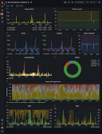

# DSC example dashboards 2.0

These dashboards contains reworked and updated graphs based on those from
`setting-up-a-test-grafana` and can be used with [Setting up a test Grafana](https://codeberg.org/DNS-OARC/dsc-datatool/wiki/Setting-up-a-test-Grafana).

**NOTE**: All graphs have a description, hover on the "i" top left corner.

To use, import into your Grafana instance (Dashboards -> Import).

Previews:

 

## Statistics

This dashboard contains statistics on packets, queries and responses with
additional graphs for failure rates and response times.

They depend on the follow DSC datasets (from sample conf): `pcap_stats`, `qtype`, `rcode`, `client_addr_vs_rcode`, `response_time`, `do_bit`, `rd_bit`.

### libpcap statistics

Shows packets per second seen by DSC (`pkts_captured`) and reported by libpcap (`filter_received`, `kernel_dropped`).

### filtered vs received

A stacked percentage based graph to show the difference between packets seen by DSC and those reported by libpcap.

### queries

Shows queries per second seen by DSC.

### responses

Shows responses per second seen by DSC.

### queries vs responses

A stacked percentage based graph to show the difference between queries and responses. If the graph swings one way or another it can indicate problems, slow queries or received spoofed DNS.

### Query Failure Rate

A graph showing relative percent of failed responses seen compared to queries received. Spikes well over 100% can indicate cache poisoning attempts where a flood of spoofed responses are received.

### RCODEs

Pie chart showing distribution of RCODEs in responses.

### Response Time log10 buckets

Query responses time shown in log 10 buckets as a stacked 100% graph, see `response_time` indexer in `dsc.conf` man-page for more information.

### DO bit

Number of queries seen with DO bit set (green line) and it's ratio against all queries seen (yellow dashed line).

### RD bit

Number of queries seen with RD bit set (green line) and it's ratio against all queries seen (yellow dashed line).

## Locations and Queries

This dashboard shows a map of where queries comes from, information about the query itself and response codes per client and query name.

They depend on the follow DSC datasets (from sample conf): `client_subnet_country`, `client_subnet_authority`, `client_subnet2`, `qtype_vs_tld`, `client_addr_vs_rcode`, `second_ld_vs_rcode`, `third_ld_vs_rcode`.

### Queries by Country

Map showing where queries comes from based on country code lookup using client IP addresses. Size and color of the mark is based on the amount of queries per second relative to the maximum.

### Queries per Authority

Pie chart showing the distribution regions the queries comes from.

### Query Classifications

Pie chart showing the distribution of classifications of the queries.

### QTYPE vs TLD (top20)

Bar chart displaying the query types per query name's top level domain.

### RCODE per IP/NET (top20)

Bar chart showing the response codes sent back to clients.

### RCODE per QNAME 2nd level domains (top20)

Bar chart showing the response codes per query name's second level domain.

### RCODE per QNAME 3rd level domains (top20)

Bar chart showing the response codes per query name's third level domain.

## python scripts

The two python scripts was used to generate parts of graphs like
"QTYPE vs TLD".

Using the new transformer "Join by label" Grafana can pivot data, and use
tags as values, when using InfluxQL. But to display bars you need to group
the data again using transformer "Group by" and it needs to be told which
columns to group by and which to summarize. That's where the script comes
in, to generate the graph JSON that is modified manually.

Then to make a top 20 the graphs use "Add field from calculation" which
is also manually modified include all possible columns.

These scripts are nothing you need to use to get the dashboards working,
they are only added here to be used for future updates.